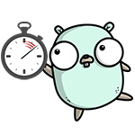

# go-watchdog



This is a remote watchdog service implemented in Go programming language. The service allows users to have timers that have a specific interval. When the timer is `kicked`, the service expects that there will be another kick within the specified interval. If not, the user is notified. The timers can be kicked by fetching a specific URL so it is easy to integrate to any system.

The login to the service and the notification mechanism uses Telegram instant messaging service. For this, you need to have or create a Telegram Bot and give it's token to the service (see `TELEGRAM_TOKEN` below). See instructions how to set up a Telegram bot [here](https://core.telegram.org/bots#3-how-do-i-create-a-bot).

The service provides a web UI for configuring and monitirong the timers and also a REST API with similar features.

## Database

The service uses currently SQLite as its database but this can be easily changed to any another database engine that is compatible with Go's `database/sql` package.

The tables are created automatically if they don't exist.

## Environment variables

- `TELEGRAM_TOKEN` - the Telegram bot token
- `WEB_PREFIX`- the prefix of the URLs (e.g. in a reverse-proxy case where the service is not placed at the root URL) (default: no prefix)
- `DATABASE` - path to the SQLite database (default `./sqlite.db`)
- `BIND` - bind address for the web server (default `127.0.0.1:1234`)

## REST API

All API calls beginning with "/api" requires to use an authentication cookie. The cookie is fetched using the Login API call.

### Timer JSON structure

```
{
    "timerid":   TimerId,
    "name":      "timer name",
    "interval":  IntervalInSeconds,
    "Expiry":    ExpiryAsUnixTime,
    "State":     "new"|"running"|"expired"
}
```

### Login

Request:

`POST /login`

Paramters:

- `key` - the user login key

Response:

- On success, status code 200 and the authentication cookie set
- On error, status code 401 (Unauthorized)

### Create new timer

Request:

`POST /api/timer`

```
{
    "name":     "timer name",
    "interval:  Interval_in_Seconds
}
```

Response:

- On success, status code 200 with the created timer as JSON

### Get timer

Request:

`GET /api/timer/<TimerId>`

Response:

- On success, status code 200 with the requested timer as JSON
- On error, status code 404

### Get list of timers

Request:

`GET /api/timer`

Response:

- On success, status code 200 with the timers as JSON array

### Delete timer

Request:

`DELETE /api/timer/<TimerId>``

Response:

- On sucess, status code 200
- On error, status code 404

### Get access token for the timer

Request:

`GET /api/timer/<TimerId>/token`

Response:

- On success, status code 200 with the access token as text
- On error, status code 404

### Kick timer

Request:

`GET /api/timer/<TimerId>/kick`

Response:

- On success, status code 200
- On error, status code 404

### Kick timer using the access token

Request:

`GET /kick/<AccessToken>`

Response:

- On success, status code 200
- On error, status code 400


# Credits

Logo is a mix of two pictures from these sources:
- https://github.com/ashleymcnamara/gophers
- https://commons.wikimedia.org/wiki/File:Dtjohnnymonkey-Stopwatch-no-shading.svg
